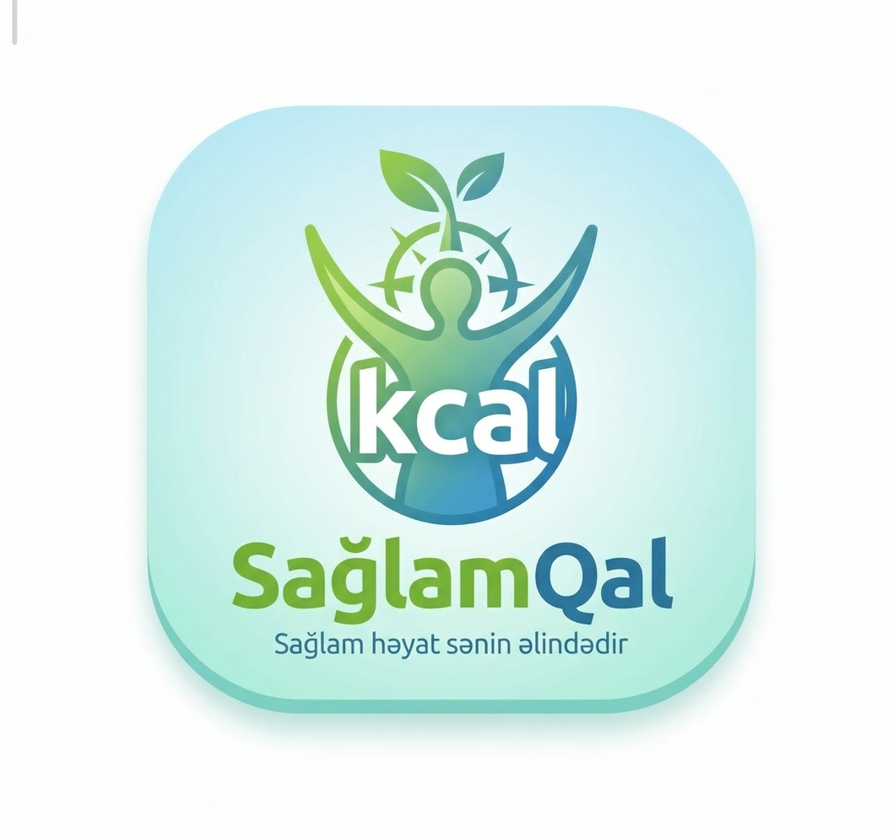

<p align="left">
  
  <strong>SağlamQal</strong>
</p>

> Şəkil çəkərək qida məlumatlarını öyrən, su xatırlatması ilə sağlam qal.


---

## 📌 Layihə haqqında

**SağlamQal** — istifadəçilərə gündəlik istehlak etdikləri qida məhsullarının tərkibini asan öyrənməyə və su balansını qorumağa kömək edən Flutter tətbiqidir.

Məhsulun şəklini çəkmək kifayətdir — **Gemini AI** avtomatik olaraq kalori, enerji, yağ, zülal və karbohidrat kimi əsas qida göstəricilərini tanıyır və təhlil edir. Bundan əlavə, tətbiq gün ərzində müəyyən saatlarda su içməyi **bildiriş** vasitəsilə xatırladır.

---

## ✨ Mövcud xüsusiyyətlər

- [x] Ana ekran (Home Screen)
- [x] Seçilmişlər ekran (Favorite Screen)
- [x] Profil ekranı
- [x] Şəkil çəkərək qida tanıma — Gemini AI inteqrasiyası
- [x] Kalori, enerji, yağ, zülal, karbohidrat məlumatları
- [x] Su xatırlatması — gün ərzində bildiriş ilə xatırlatma

---

## 🔄 Planlaşdırılır

- [ ] Azərbaycanca / Rusca / İngiliscə dil dəstəyi

---

## 🛠 Tech Stack

| Texnologiya                 | İstifadə məqsədi               |
| --------------------------- | ------------------------------ |
| Flutter                     | Cross-platform mobil tətbiq    |
| Dart                        | Proqramlaşdırma dili           |
| Gemini AI                   | Şəkildən qida tanıma və analiz |
| dio                         | API sorğuları                  |
| flutter_local_notifications | Su xatırlatma bildirişləri     |
| shared_preferences          | Lokal ayarların saxlanması     |

---

## 📸 Skrinşotlar

| Ana ekran  | Qida analizi | Qida məlumatı | Su xatırlatması |
| ---------- | ------------ | ------------- | --------------- |
| _tezliklə_ | _tezliklə_   | _tezliklə_    | _tezliklə_      |

---

## 🚀 Quraşdırma

```bash
# Layihəni klonla
git clone https://github.com/istifadeciadı/saglam-qal.git

# Qovluğa keç
cd saglam-qal

# Asılılıqları yüklə
flutter pub get

# Tətbiqi işə sal
flutter run
```

---

## 📁 Layihə strukturu

Bu layihə **Clean Architecture** + **Feature-based** struktur üzərində qurulub.
