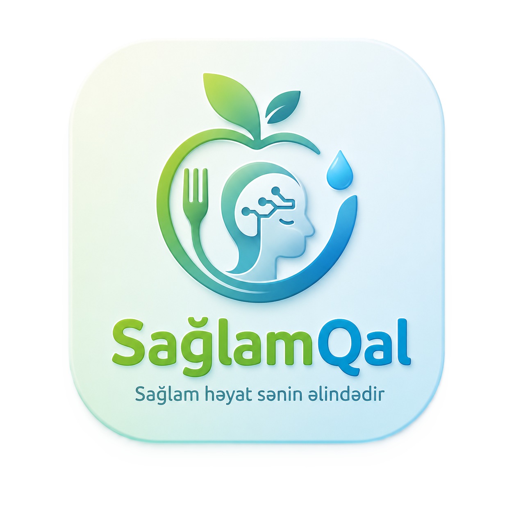

<h1>
  
  SağlamQal
</h1>

> Qidalanmanı izlə, su balansını qoru və sağlam həyat vərdişlərini bir tətbiqdən idarə et.


---

## 📌 Layihə haqqında

**SağlamQal** — istifadəçilərin gündəlik qidalanma və sağlam həyat vərdişlərini daha rahat izləməsinə kömək etmək üçün hazırlanmış Flutter mobil tətbiqidir.

Tətbiq **Gemini AI** vasitəsilə qida şəklini analiz edərək kalori, enerji, yağ, zülal və karbohidrat kimi əsas qida göstəricilərini müəyyən edə bilir.

Bununla yanaşı, istifadəçi gün ərzində su içmə xatırlatmaları yarada, şəxsi profil və sağlamlıq məlumatlarını idarə edə bilər.

Layihə aktiv inkişaf mərhələsindədir. Dietoloq–pasiyent əlaqəsi, fərdi diet planları, çəki izləmə, gündəlik yemək izləmə və addım hesablama kimi daha geniş sağlamlıq funksiyaları üzərində iş davam edir.

---

## ✨ Mövcud xüsusiyyətlər

- [x] Ana ekran
- [x] İstifadəçi qeydiyyatı və giriş
- [x] Google ilə giriş
- [x] Şəxsi profil məlumatlarının yaradılması
- [x] Profil ekranı
- [x] Seçilmişlər ekranı
- [x] Şəkil çəkərək qida tanıma — Gemini AI
- [x] Kalori, enerji, yağ, zülal və karbohidrat analizi
- [x] Su xatırlatmalarının yaradılması
- [x] Lokal bildirişlər ilə su xatırlatması

---

## 🚧 İnkişaf mərhələsində / Planlaşdırılır

Aşağıdakı funksiyalar layihənin inkişaf planına daxildir. Bəzi hissələr `develop` branch-də hazırlanır və hələ stabil `main` versiyasına daxil edilməyib.

### 👨‍⚕️ Dietoloq sistemi

- [ ] Dietoloqlar bölməsi
- [ ] Dietoloq–pasiyent əlaqəsinin yaradılması
- [ ] Dietoloq dəvətlərinin qəbul və rədd edilməsi
- [ ] İstifadəçinin aktiv dietoloqunun göstərilməsi
- [ ] Dietoloq tərəfindən fərdi diet planının təyin edilməsi

### 🥗 Diet plan və gündəlik qidalanma

- [ ] Aktiv diet planının mobil tətbiqdə göstərilməsi
- [ ] Günlər və yeməklər üzrə diet planının izlənməsi
- [ ] Gündəlik yemək Check-In sistemi
- [ ] Yerinə yetirilmiş yeməklərin faiz göstəricisi
- [ ] Keçmiş diet planlarının tarixçəsi

### ⚖️ Sağlamlıq və aktivlik izləmə

- [ ] Çəki izləmə (Weight Tracking)
- [ ] Çəki dəyişiminin tarixçə və qrafiklə göstərilməsi
- [ ] Gündəlik addım hesablama
- [ ] Gündəlik addım hədəfi
- [ ] Addım və aktivlik statistikasının göstərilməsi
- [ ] Sağlamlıq göstəricilərinin ümumi analizi

### 🌐 Digər planlar

- [ ] Azərbaycanca / Rusca / İngiliscə dil dəstəyi
- [ ] Dietoloq profil və məlumatlarının genişləndirilməsi
- [ ] Bildiriş sisteminin genişləndirilməsi
- [ ] Sağlamlıq statistikalarının daha detallı vizuallaşdırılması

---

## 🛠 Tech Stack

| Texnologiya                 | İstifadə məqsədi                       |
| --------------------------- | -------------------------------------- |
| Flutter                     | Cross-platform mobil tətbiq            |
| Dart                        | Proqramlaşdırma dili                   |
| BLoC                        | State management                       |
| Clean Architecture          | Layihə arxitekturası                   |
| dio                         | REST API sorğuları                     |
| get_it                      | Dependency Injection                   |
| go_router                   | Navigation və routing                  |
| Gemini AI                   | Şəkildən qida tanıma və analiz         |
| flutter_local_notifications | Lokal bildirişlər və su xatırlatmaları |
| shared_preferences          | Lokal məlumat və ayarların saxlanması  |

---

## 🧱 Arxitektura

Layihə **Clean Architecture** və **Feature-based Architecture** yanaşması ilə hazırlanır.

Əsas qatlar:

```text
lib/
├── core/
│   ├── constants/
│   ├── di/
│   ├── network/
│   ├── router/
│   └── utils/
│
└── features/
    ├── auth/
    ├── home/
    ├── profile/
    ├── favorites/
    ├── water_reminder/
    ├── dietitians/
    └── ...
```

Feature-lar daxilində əsasən aşağıdakı struktur istifadə olunur:

```text
feature/
├── data/
│   ├── datasource/
│   ├── mappers/
│   ├── models/
│   └── repositories/
│
├── domain/
│   ├── entities/
│   ├── repositories/
│   └── usecases/
│
└── presentation/
    ├── bloc/
    ├── pages/
    └── widgets/
```

Bu yanaşma UI, business logic və data layer arasında məsuliyyətlərin ayrılmasını təmin edir.

---

## 📸 Skrinşotlar

| Ana ekran  | Qida analizi | Dietoloqlar | Diet plan |
| ---------- | ------------ | ----------- | --------- |
| _tezliklə_ | _tezliklə_   | _develop_   | _develop_ |

---

## 🚀 Quraşdırma

```bash
# Layihəni klonla
git clone <repository-url>

# Qovluğa keç
cd saglam-qal

# Asılılıqları yüklə
flutter pub get

# Tətbiqi işə sal
flutter run
```

---

## 🌿 Branch strukturu

```text
main
└── Stabil və təqdim edilə bilən versiya

develop
└── Yeni feature-ların inteqrasiya və test edildiyi inkişaf versiyası
```

Hazırda dietoloq sistemi, diet plan inteqrasiyası və əlaqəli sağlamlıq funksiyalarının bir hissəsi `develop` branch-də inkişaf və test mərhələsindədir.

---

## 🎯 Məqsəd

SağlamQal-ın məqsədi yalnız kalori göstərən tətbiq olmaq deyil.

Layihənin uzunmüddətli istiqaməti istifadəçinin:

- qidalanmasını,
- su qəbulunu,
- çəkisini,
- gündəlik aktivliyini və addımlarını,
- diet planını,
- dietoloq ilə əlaqəsini

vahid mobil platformadan izləyə bilməsini təmin edən sağlamlıq ekosistemi yaratmaqdır.
